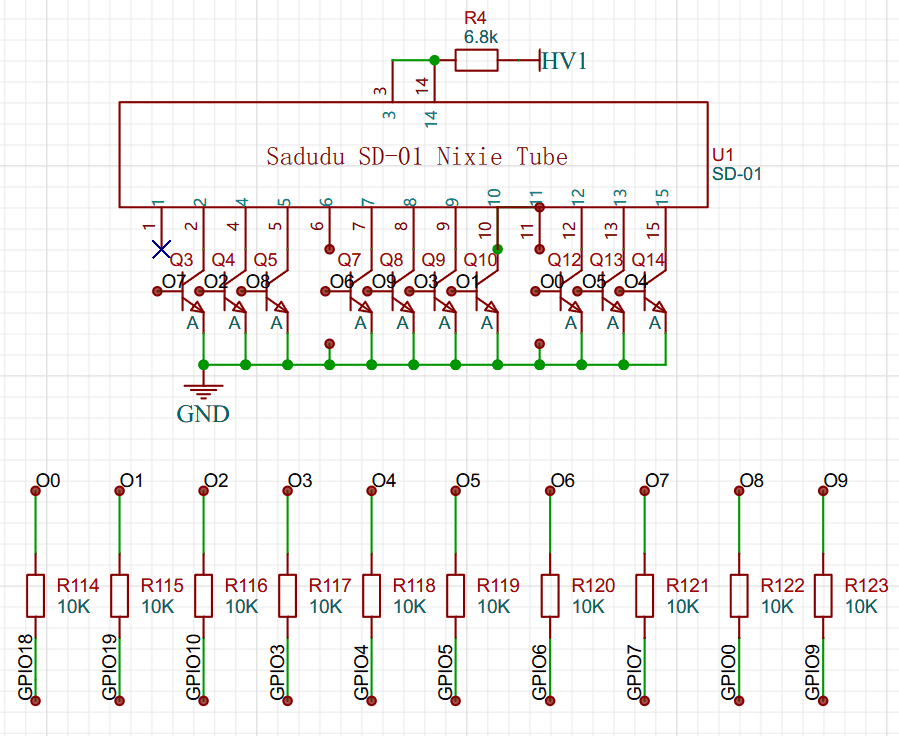
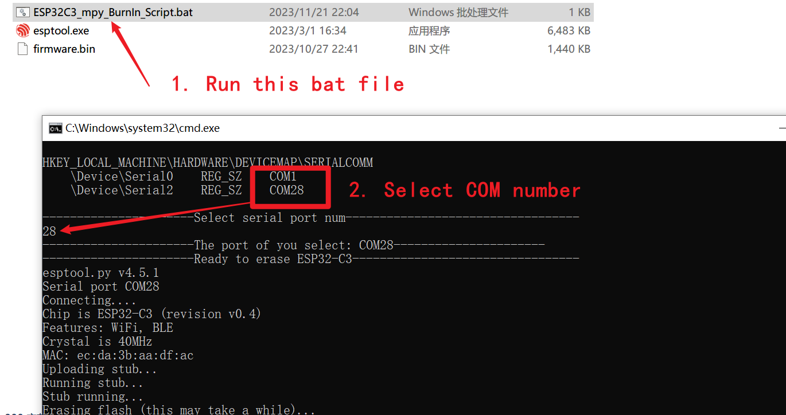

# iNixieLab-Kit 中文说明

说明主要分成两个部分，分别是硬件和软件两个部分。

# 硬件

## DGM01的DataSheet


## DGM01驱动电路


通过上图可知，DGM01是共阳极的驱动，通过IO口控制下端的高压三极管通断，即可点亮对应的数字。
<font face="黑体" color=red size=5>即通过拉高IO口的电平即可点亮对应的数字，需要注意的是尽量不要将所有的数字点亮，因为此时功耗比较高，长时间工作可能不稳定。</font>

# 软件

在进行编程和具体的操作之前，需要安装USB转串口的驱动，我们使用的芯片为CH340，可以去[沁恒官网](https://www.wch.cn/downloads/CH341SER_ZIP.html)自行下载驱动，这里我们也提供下载好的Windows[驱动文件](./driver/CH341SER.ZIP)，直接解压出来双击安装即可。


## Arduino
1. 搭建编译环境

+ 这里以VsCode中，使用PlatformIO插件为例提供完整的驱动代码。搭建编译环境的具体过程可以查看此[视频教程](https://www.bilibili.com/video/BV1tv411w74d/?spm_id_from=333.337.search-card.all.click&vd_source=31a5159a82c83be8fc695de9e1b385a2)，视频后面也讲解了Wi-Fi、BLE和对应的RTOS的使用，在提供的Arduino示例中也用到了这些内容。

2. Wi-Fi部分

+ 下面是Wi-Fi部分的代码，在"Network.cpp"文件中，将其中的“SSID”和“PSWD”字符串替换为自己的Wi-Fi账号和密码，然后便可连接Wi-Fi和访问网络，具体代码如下：
```
const char *SSID = "XXXXXXXX";                  // 需要连接到的WiFi名
const char *PSWD = "XXXXXXXX";                  // 连接的WiFi密码
```

3. 蓝牙部分
+ 蓝牙部分使用的是BLE而非经典蓝牙，在Demo中单独开启了一个线程来操作BLE，具体内容在“BLE.cpp”文件中，其中具体的需要用到或者需要修改的内容有“BLE_Init”函数中设置BLE的名字，Demo中将BLE的名字修改为“iNixie-Kit”。

+ 其次是“gstBleInfo.boBleConnectStatue”和“gstBleInfo.boBleConnectStaBak”这两个全局变量，分别用于存储当前的BLE连接状态和记录上一次的状态，可通过这两个变量来判断连接和断开的时刻。

+ 然后是"notify"，即ESP32对上位机发送消息，具体需要设置两个变量，一个是需要传输的数据，存放到“gstBleInfo.ubTxBuffer”中，并且需要得到Buffer的长度，放到“gstBleInfo.ubTxLength“中，最后通过这两个函数将数据发送出去。
```
pTxCharacteristic->setValue(gstBleInfo.ubTxBuffer, gstBleInfo.ubTxLength);
pTxCharacteristic->notify();                // 广播
```
+ 最后是ESP32接收上位机的信息，具体在”BLE_ShowRxInfo“这个函数将所有收到的信息以16进制的方式打印出来，如果需要改写自己的信息，在此处修改就行。

4. RX8025T的驱动

+ RX8025T是一个高精度带温度补偿的RTC芯片，驱动只需要初始化以后，便可读取和写入数据。在示例代码中，读取的时间全部存到”gstRTC“这个全局的结构体中。如果需要写入对应的时间，比如从上位机收到BLE数据写时间，或者获取到了网络时间需要写入到RX8025T芯片中，只需要调用”RX8025_SetTime“这个函数即可。


5. DGM01的驱动代码
+ 根据前面对硬件的分析，此处的软件上使用RTOS实现了一个软件的PWM，即在Arduino的示例中提供了完整的亮度控制。具体的驱动代码在“Task_iNixie”这个线程中，通过修改全局数组“gpubNixieLight”，即可实现每个数字的亮度变化，具体的亮度取值范围为0-9。

## MicroPython

1. 烧录MicroPython

+ 下面是烧录的具体内容，以Windows为例，这里使用官方提供的esptool.exe，这里也提供下载好的MicroPython固件，并且写了一个简单的烧录脚本，直接运行并且选择对应的串口号即可。

+ 录以后这里使用Thonny软件为例来编写MicroPython代码，以下是具体的说明。

2. Wi-Fi部分

+ 同Arduino的示例，此处也是先将这里的Wi-Fi对应的SSID和PSWD修改成自己的信息，然后上电后等待连接即可,具体的函数是”do_connect“。


3. 蓝牙部分
+ 蓝牙部分的代码在 ble.py 文件中，当收到具体的上位机发送的信息以后，将所有的数据打印出来，在main.py的主循环中运行。


4. RX8025T的驱动代码
+ RX8025T具体的使用是主要关注两点，分别是读取时间和写入时间，这个在代码中都有具体的体现。

5. DGM01的驱动代码
+ DGM01的点亮只需要将对应的IO设置为高电平即可，在示例代码中，分别将辉光管中0-9对应的数字其对应的引脚存到数组中，然后依次给对应的高电平即可。
